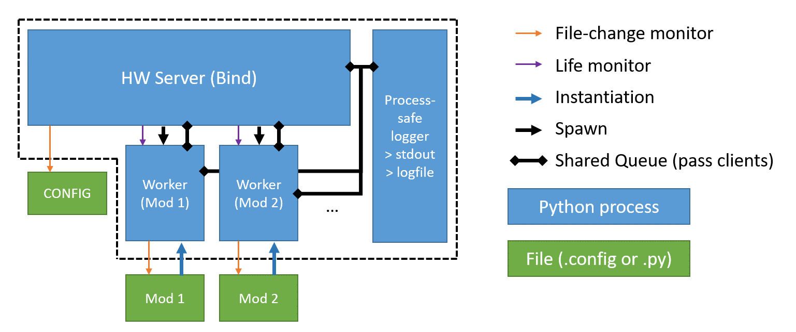
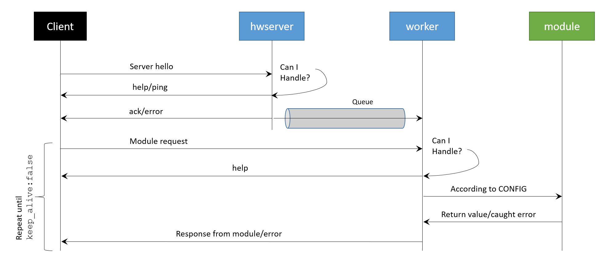

https://github.com/mwalsh161/ModuleServer

Tested on python 3.7 (uses all builtin libraries)

# ModuleServer
The server runs as a standalone process to receive the initial client request.
The client is passed off to a different process (the "worker") that manages the module requested by the client to fulfill the rest of the client's request.

The server monitors the workers and the workers monitor the module they are assigned to.
If a worker dies, the server will try to restart it.
If the code in a module gets modified, the worker will reload the module when it isn't busy with a client.

The server reads a config file to know which modules to load, and will monitor that config file for changes during runtime when it isn't busy.
It will take care of loading/unloading modules based on the updated config.

Diagram showing the general construction of the server:


# Setup
## Server Setup
You can create a `server.py` file as follows:
```python
import logging, os, sys
import ModuleServer.server as server

BASE_PATH = os.path.dirname(os.path.abspath(__file__))

LOGLEVEL = logging.INFO
CONFIG_PATH = os.path.join(BASE_PATH,'server.config')
SERVER_IP = 'localhost' # 0.0.0.0 to bind to all interfaces
SERVER_PORT = 36577
LOGFILE = os.path.join(BASE_PATH,'logs','server.log')

if __name__ == '__main__':
    server.main('HW Server',CONFIG_PATH,SERVER_IP,SERVER_PORT,LOGLEVEL,LOGFILE)
```
This file implies that there is a `server.config` file in the same directory as well as a folder called `logs`.

## Config file
This just needs to be a JSON file that informs the server's workers how to load and dispatch requests to your module.
Entries that have an underscore as the first character of the module name are ignored.
The format is a dictionary with keys being the module names and values being a list: \["module import path", "class name or function entry point", "dispatch method in class or null if calling directly by client request"\]
```json
{
    "moduleA": [
        "mymodules.moduleA",
        "moduleA",
        "foo"
    ],
    "_moduleB": [
        "mymodules.moduleB",
        "bar",
        null
    ]
}
```
### Directory structure for Example
```
myproject/
    server.py
    server.config
    mymodules/
        __init__.py
        moduleA.py
        moduleB.py
    logs/
        server.log
        server.log.1
        ...
        server.log.5
```

## Modules
Modules don't have a particular required recipe. Here is a possible implementation to complete the example (based on the config file).
moduleA.py:
```python
import os, logging, time
logger = logging.getLogger(__name__)

class moduleA:
    def __init__(self):
        logger.debug('Here we go')
        time.sleep(3)
        logger.debug('Loaded')

    def foo(self,client_ip,fn_name,*args):
        logger.debug('Calling '+fn_name+str(args))
        return 'You successfully called the dispatching method!'
```
moduleB.py:
```python
import os, logging, time
logger = logging.getLogger(__name__)

class bar:
    def fun1(self,*args):
        logger.debug('Called fun1 directly! Args: '+str(args))
        return 'No dispatching method necessary.'
```

Note, workers setup root logger properly, so modules can inherit and log easily at any level:
```python
import logging
logger = logging.getLogger(__name__)
logger.info('testing123...')
```

## Clients

Client connects with server.py on host machine to communicate with modules. Here is an example of creating a client.

```python
from client import client
myclient = client(host = 'localhost')
```

The client.ping() method can be issued to ping the server to get the client's IP address and binding port.

```python
print(myclient.ping())
```

The client.com(module, funcname, *args) method can be called to communicate with a module and request it to perform a function. Here is an example of requesting "moduleA" to call "foo" with arguments ['ay', 1, False, None].

```python
resp = client_1.com('moduleA', 'foo', 'ay', 1, False, None)
print(resp)
```

```python
You successfully called the dispatching method!
```

The client.help() method can be called to get server help text.

The client.get_modules(prefix='') method will return a list of module names that are loaded. If you specify .*
(e.g. myclient.get_modules('msquared')), only the modules that begin with * will be returned.

The client.reload(module) method can be issued to force a reload of the module specfied.

# API/Protocol
See [server.py](server.py) for more details. The general flow for the protocol is below:

